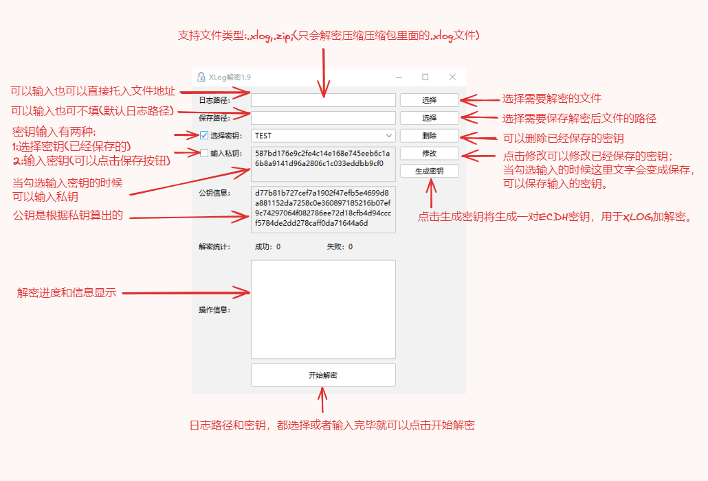
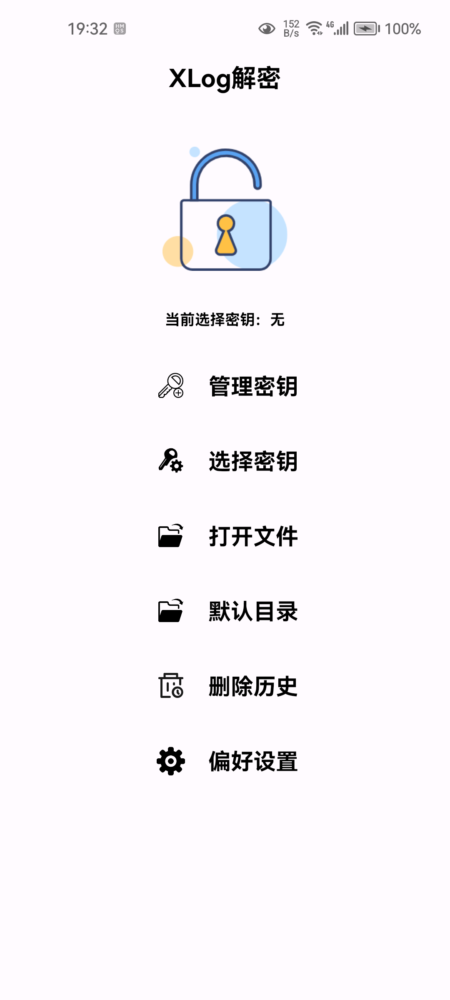
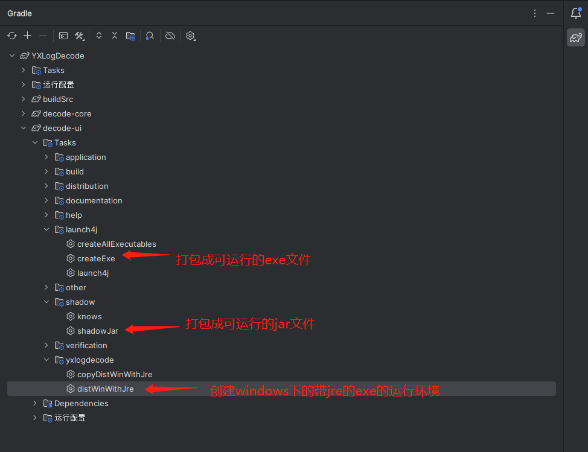

<p align="center"></p>

# YXLogDecode

  

**`YXLogDecode`** 是腾讯Mars-xlog的解密的Java实现版本，核心来自<a href="https://github.com/wustMeiming/XlogDecoder">XlogDecoder</a>。
- 支持UI操作；
- 支持压缩加密文件和只压缩文件的解密解压缩；
- 压缩方式支持：ZIP，ZSTD；
- 增加了一个可以在Android上运行的解密核心 **`android/decode-core`**；
- 增加了一个Android上解密查看日志的APP；

### 目录

- [概述](#概述)
- [安装使用](#安装使用)
- [构建运行](##构建运行)
    - [Desktop](#Desktop)
    - [Android](#Android)
- [常见错误](##常见错误)
- [感谢](##感谢)

## 概述

**`YXLogDecode`** 简单使用说明





## 电脑端安装使用

**`YXLogDecode`** 需要JDK（版本需要1.8版本以上的OpenJdk）

**`Windows`** 系统可以直接下载[Release](https://github.com/zhanlan123/YXlogDecode/releases)下的已经打成zip压缩包的文件，里面自带JRE。

**`MAC,Linux`** 直接下载[Release](https://github.com/zhanlan123/YXlogDecode/releases)下的jar文件，然后自行下载OpenJdk。

如果使用 **`OracleJdk`** 那么请按照下面方式修改：

- 1: 修改 JAVA_HOME\jre\lib\security\java.security 文件, 添加如下内容:

```ini
security.provider.11=org.bouncycastle.jce.provider.BouncyCastleProvider
```
**其中security.provider.11中的11是根据已有的配置行顺序而定的，如下**

```ini
security.provider.1=sun.security.provider.Sun
security.provider.2=sun.security.rsa.SunRsaSign
security.provider.3=sun.security.ec.SunEC
security.provider.4=com.sun.net.ssl.internal.ssl.Provider
security.provider.5=com.sun.crypto.provider.SunJCE
security.provider.6=sun.security.jgss.SunProvider
security.provider.7=com.sun.security.sasl.Provider
security.provider.8=org.jcp.xml.dsig.internal.dom.XMLDSigRI
security.provider.9=sun.security.smartcardio.SunPCSC
security.provider.10=sun.security.mscapi.SunMSCAPI
security.provider.11=org.bouncycastle.jce.provider.BouncyCastleProvider
```

- 2: 在JAVA_HOME\jre\lib\ext 文件夹中加入源码目录jar下的
 
```text
bcprov-jdk18on-1.73.jar
```
[下载bcprov-jdk18on-1.73.jar](./jar/bcprov-jdk18on-1.73.jar)

**如果有其他的`BC` jar请删除**


## 构建运行

`Gradle运行的需要配置JDK是OpenJdk 17以上，项目依赖也需要配置OpenJdk以上，不能是Oracle Jdk`

### Desktop

- 1: 使用Android Studio 打开，然后点击运行就可以。
- 2: 使用Android Studio 构建，如下图所示。



- 3：使用Gradle进行构建：

**`window`**

```cmd
# 打包成可运行的exe文件
.\gradlew.bat :decode-ui:createExe 

# 打包成可运行的jar文件
.\gradlew.bat :decode-ui:shadowJar

# 打包带JRE和exe的zip文件
.\gradlew.bat :decode-ui:distWinWithJre
```

**`Linux,MAC`**

```bash
# 打包成可运行的exe文件
.\gradlew :decode-ui:createExe 

# 打包成可运行的jar文件
.\gradlew :decode-ui:shadowJar

# 打包带JRE和exe的zip文件
.\gradlew :decode-ui:distWinWithJre
```

### Android

**`Android`** 上提供解密日志和查看日志的APP和解密核心和一个简单的测试DEMO，如果需要集成到APP中。
**`APP`可以通过分享等其它方式打开日志文件和电脑端的config.ini文件导入密钥**

- 1: 编译APP
  - 1: 直接编译APP源码: **`android/app`**

- 2: 集成核心
  - 1: 或自己集成解密源码: **`android/decode-core`**

  - 2: 或集成打包好的核心-下载源码目录中的：**`jar/decode-core-1.0.aar`**

  - 3: 然后在build.gradle中增加如下依赖：
```groovy
// https://mvnrepository.com/artifact/org.apache.commons/commons-lang3
implementation("org.apache.commons:commons-lang3:3.12.0")
// https://mvnrepository.com/artifact/com.github.luben/zstd-jni
implementation("com.github.luben:zstd-jni:1.5.4-2@aar")
```


## 常见错误

- 1: 使用了OracleJdk，但是没有按照说明修改。

```bash
java.security.NoSuchProviderException: JCE cannot authenticate the provider BC
```

- 2：密钥错误

```bash
java.util.concurrent.ExecutionException: java.lang.NullPointerException: Cannot read the array length because "<parameter1>" is null
```

**如果出现此错误，请使用测试公钥替换你自己的公钥试一试；**

- 测试公钥：

**`94e62d97637f357fbd20f0c1f667a67c2f675e158e46015dd0cc54cb3995d0a5d468f7e98b20aec266effb61ec0a2321fb1f8c61af72bf76567921a0d8305005`**

## 感谢

<ul>
    <li><a href="https://github.com/wustMeiming/XlogDecoder">XlogDecoder</a></li>
    <li><a href="https://www.bouncycastle.org/latest_releases.html">bcprov-jdk18on</a></li>
    <li><a href="https://commons.apache.org/proper/commons-lang/">commons-lang3</a></li>
    <li><a href="https://github.com/JFormDesigner/FlatLaf">flatlaf</a></li>
    <li><a href="http://www.miglayout.com/">miglayout-swing</a></li>
    <li><a href="http://ini4j.sourceforge.net/">ini4j</a></li>
    <li><a href="https://commons.apache.org/proper/commons-io/">commons-io</a></li>
    <li><a href="https://github.com/srikanth-lingala/zip4j">zip4j</a></li>
    <li><a href="https://github.com/skylot/jadx">jadx</a></li>
    <li><a href="http://launch4j.sourceforge.net/">Launch4j</a></li>
    <li><a href="https://github.com/Rosemoe/sora-editor">sora-editor</a></li>
    <li><a href="https://github.com/AndroidIDEOfficial/AndroidIDE">AndroidIDE</a></li>
    <li><a href="https://github.com/Blankj/AndroidUtilCode">AndroidUtilCode</a></li>
</ul>


