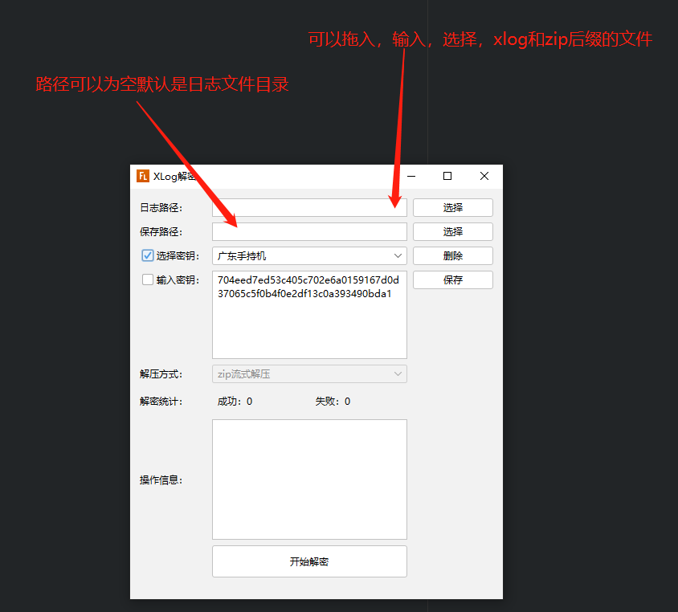
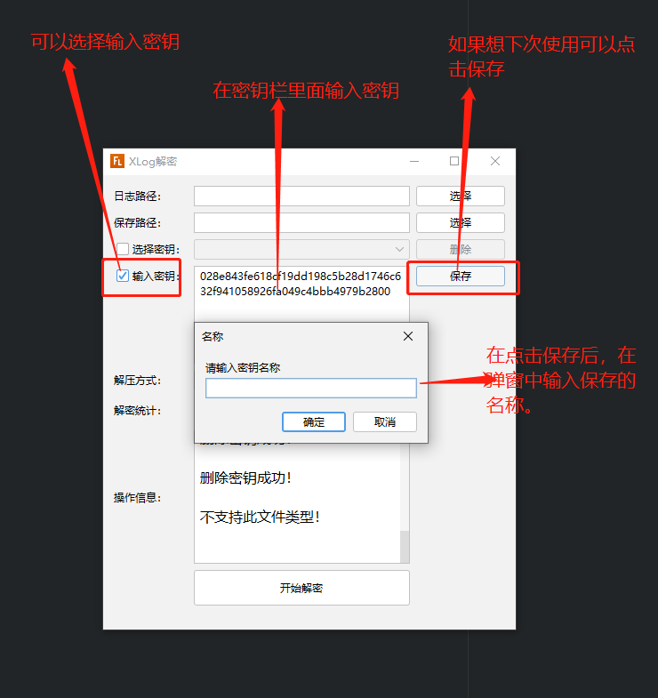
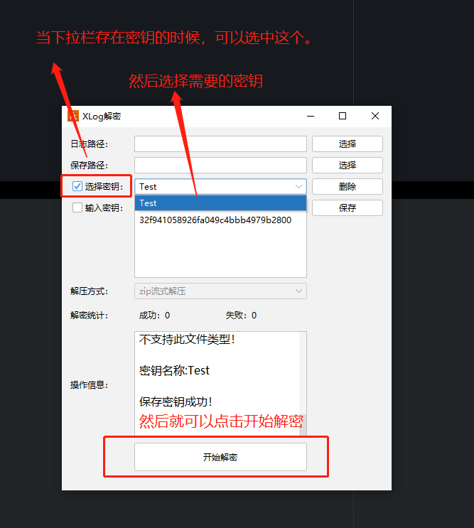

# YXLogDecode

XLog 的解码服务，可解码不加密、加密两种。可以在UI界面中添加解密私钥。

核心代码来自：https://github.com/wustMeiming/XlogDecoder，更改了一些代码和增加了zstd支持

左边点击release 可以下载已经提供exe包自带jre，可以直接运行。

**当前存在的问题**
- 1:文件只压缩无加密，输入空密钥无法解密；
  解决办法：可以任意选择一个密钥（因为是根据文件内容判断是不是加密的）

**支持zstd, zip压缩格式**
**兼容 mars-xlog的版本：1.0.5, 1.0.6, 1.0.7, 1.2.3, 1.2.4, 1.2.5, 1.2.6**

**如果想集成到android中使用，需要更改解密库，暂时不支持**

**如果需要解密自己的加密日志，请删除测试的密钥TEST，或者选择输入密钥，填写自己的私钥，点击保存。**

## Thanks

<ul>
    <li><a href="https://github.com/wustMeiming/XlogDecoder">XlogDecoder</a></li>
    <li><a href="https://www.bouncycastle.org/latest_releases.html">bcprov-jdk18on</a></li>
    <li><a href="https://commons.apache.org/proper/commons-lang/">commons-lang3</a></li>
    <li><a href="https://github.com/JFormDesigner/FlatLaf">flatlaf</a></li>
    <li><a href="http://www.miglayout.com/">miglayout-swing</a></li>
    <li><a href="http://ini4j.sourceforge.net/">ini4j</a></li>
    <li><a href="https://commons.apache.org/proper/commons-io/">commons-io</a></li>
    <li><a href="https://github.com/srikanth-lingala/zip4j">zip4j</a></li>
    <li><a href="https://github.com/skylot/jadx">jadx</a></li>
    <li><a href="http://launch4j.sourceforge.net/">Launch4j</a></li>
</ul>

### LICENSE